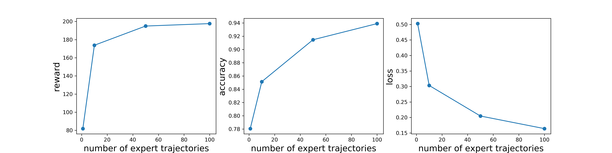
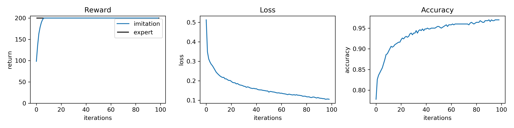
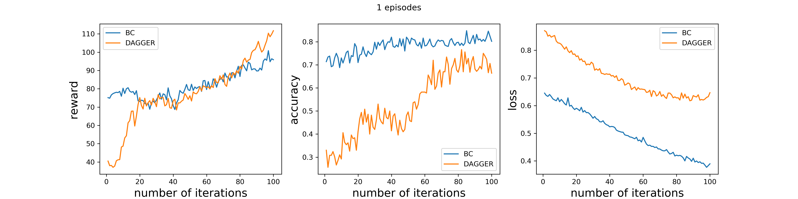
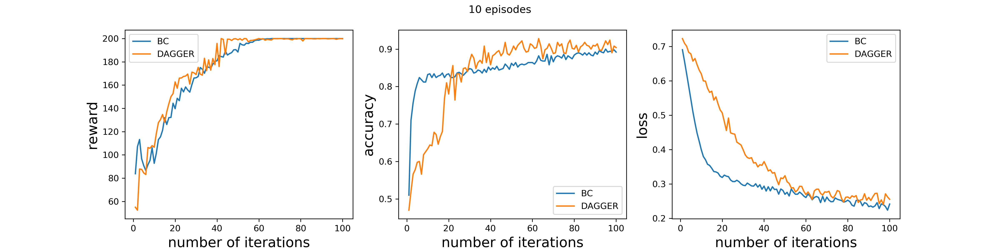
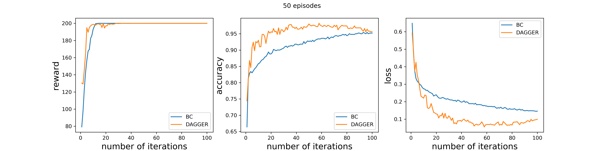
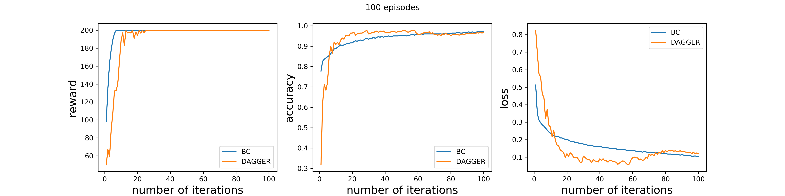

# Behavior Cloning, Imitation Learning and GAIL

# Behavior Cloning

- *Expert*: 
    
    
- *Expert vs Student*: 
    

- *BC vs DAGGER at 1 episode*: 
    
    
- *BC vs DAGGER at 10 episode*: 
    
    
- *BC vs DAGGER at 50 episode*: 
    
    
- *BC vs DAGGER at 100 episode*: 
    
