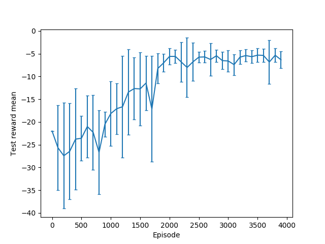
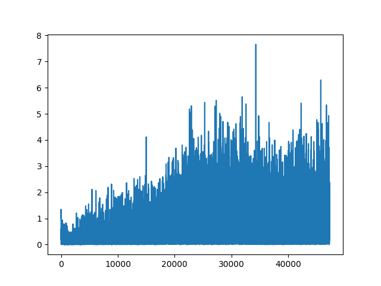
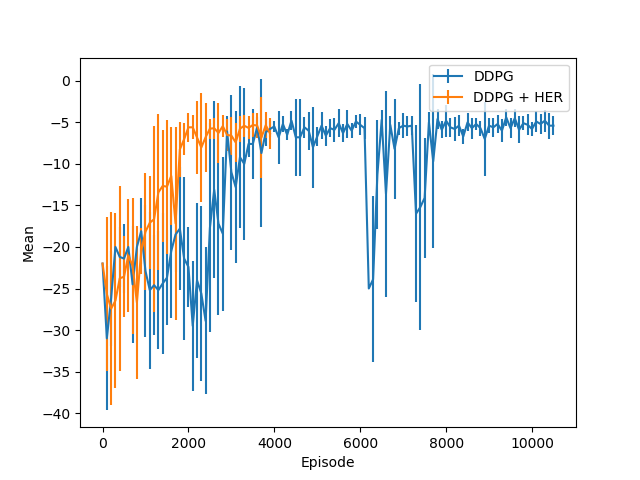
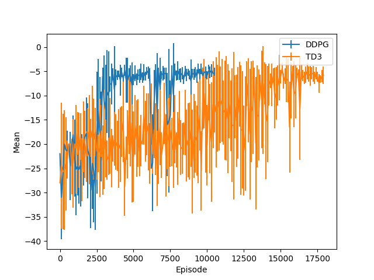

# DDPG and HER

This folder contains template code to help you implement DDPG and HER. As a reminder, you are not required to use this code. This folder is organized as follows:

- algo/

    - `__init__.py`  - Intentionally empty file so we can import other files from this directory.
    
    - `ActorNetwork.py`  - The actor network here.
    
    - `CriticNetwork.py`  - The critic network here.
    
    - `ddpg.py`  - Implement the DDPG training loop. You will import the actor and critic networks created by the files above.
    
    - `ReplayBuffer.py`  - A simple buffer for storing experience. You do not need to modify anything here.
    
- envs/

    `__init__.py`  - Intentionally empty file so we can import other files from this directory.
    
    `2d_point.py`  - A simple environment that might be helpful for debugging. Does not support HER.
    
    `2Dpusher_env.py`  - The environment that you should use for evaluating DDPG and HER.
    
- `requirements.txt`  - The recommended python dependencies. You can install them all by running `pip install -r requirements.txt`.

## Performance

- *DDPG*: 
    
    

- *Gradients for the training process in DDPG*: 
    

- *DDPG with HER*: 
    

- *TD3*: 
    
