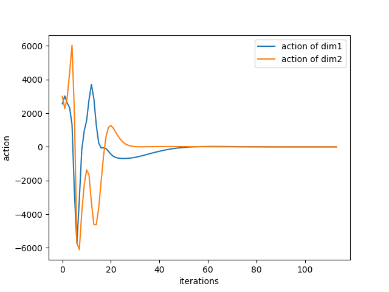
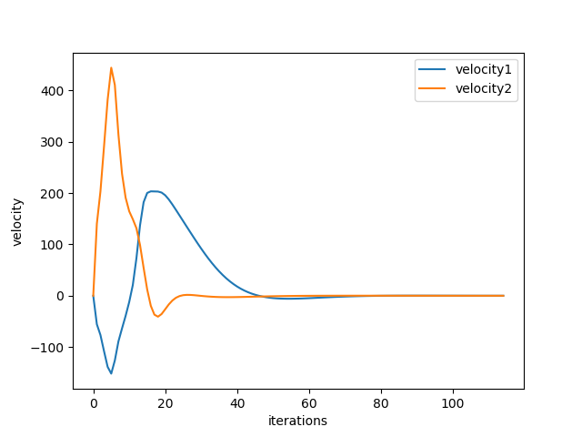

# LQR and iLQR

You will be controlling a simple 2-link planar arm. It is based on the OpenAI gym API with a couple of additions you will need to approximate the dynamics. The environment comes with rendering code so that you can visually see what the arm is doing. The environments themselves define a cost matrix Q and a cost matrix R. Use these when calculating your trajectories. The rewards returned by the environment are computed using the LQR cost function. The step function includes an additional argument dt. When calculating the finite differences your dt will be much smaller than the dt that the simulator normally steps at when calling step. So when executing a command you should just use step with an action. When you are trying to approximate the dynamics using finite differences you should use step and override the dt argument as well. You can also explicitly set the state of this simulator using the state attribute. You will need this when doing finite differences. Just set this attribute equal to the q and q˙ values you want before calling step.

## GIF Animation for CartPole

## Performance

- Action

  
  
- Postion

  
  
- Velocity

  
